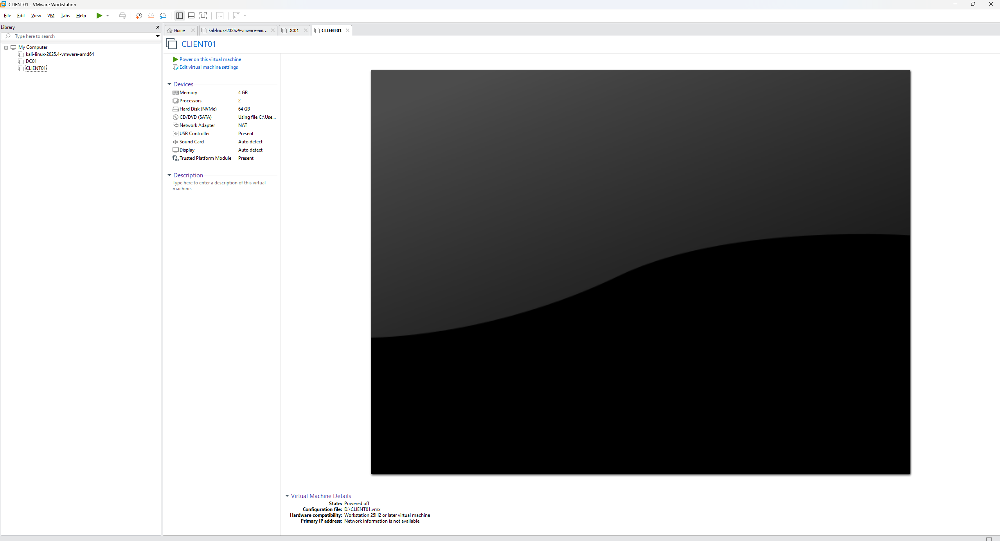
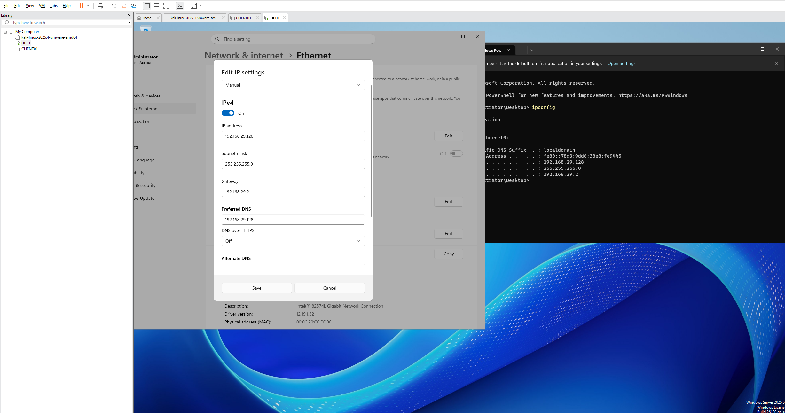
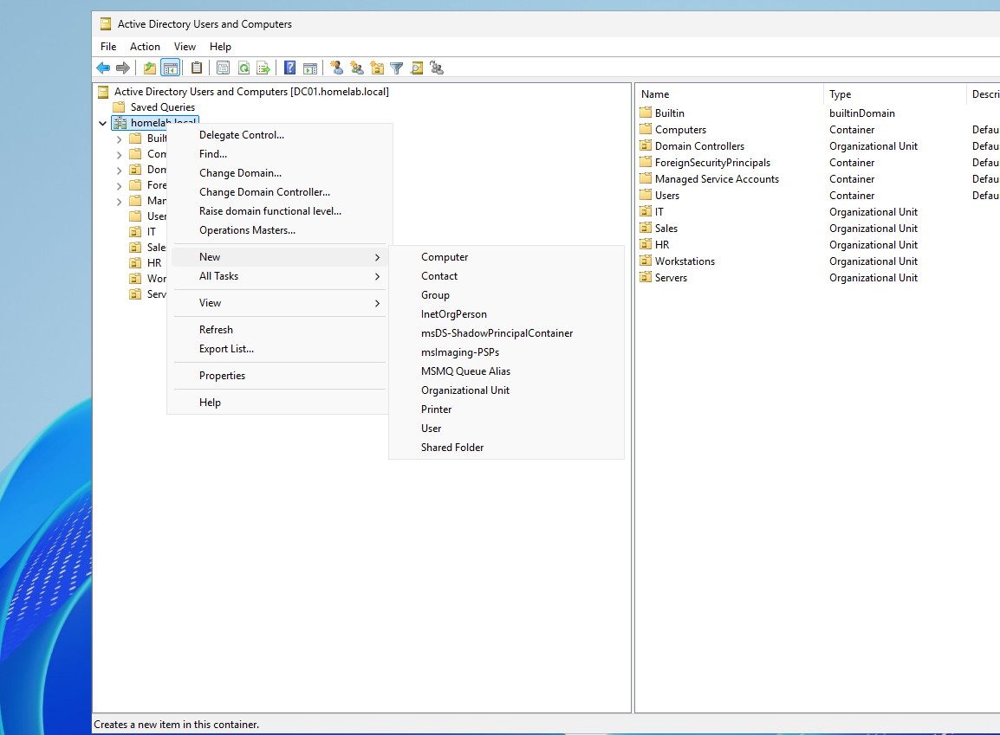
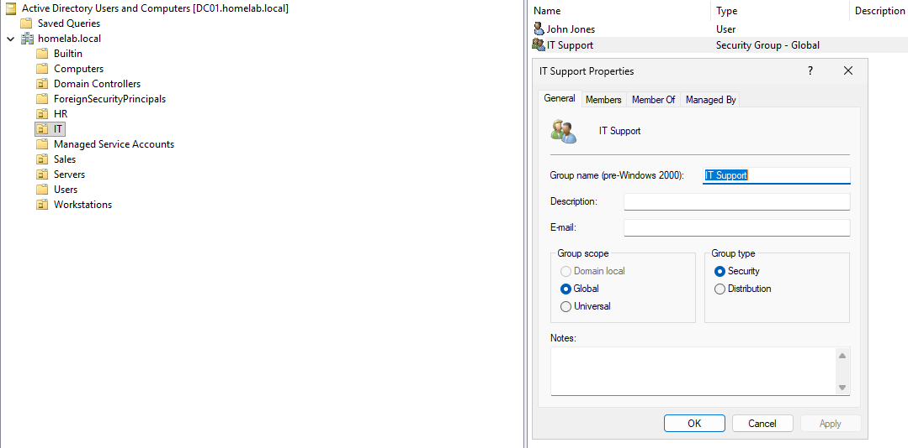
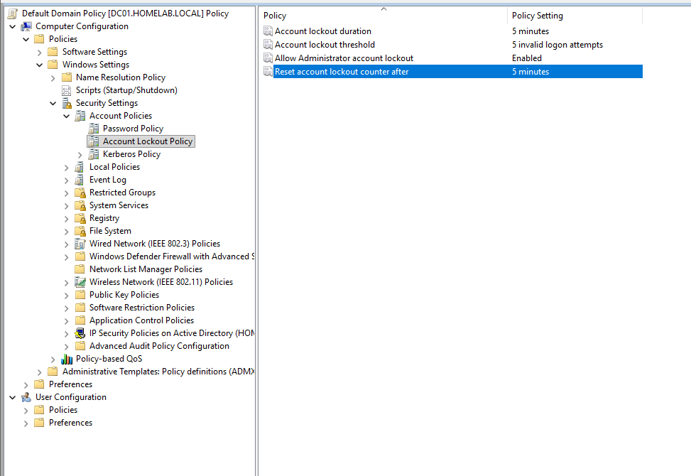
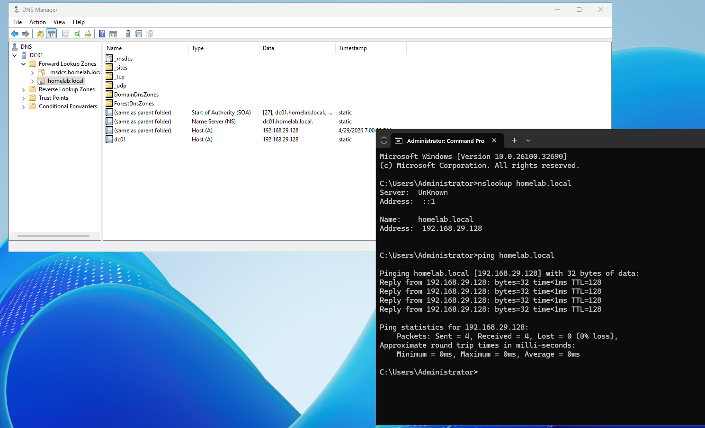
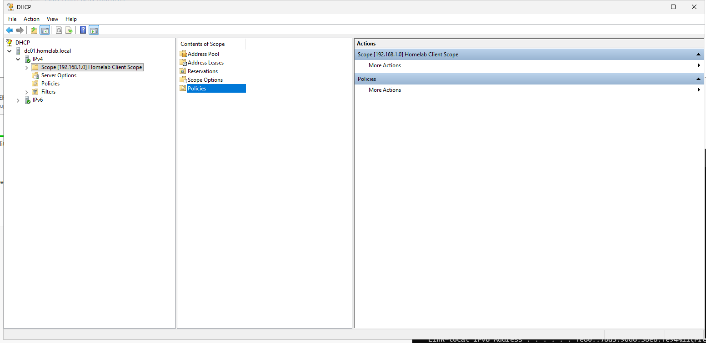
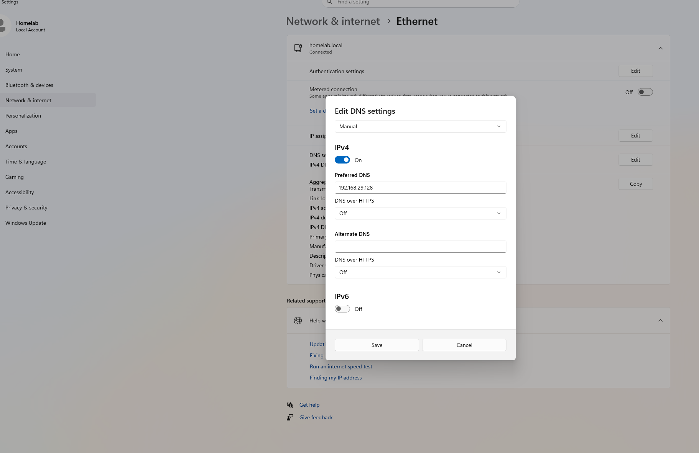
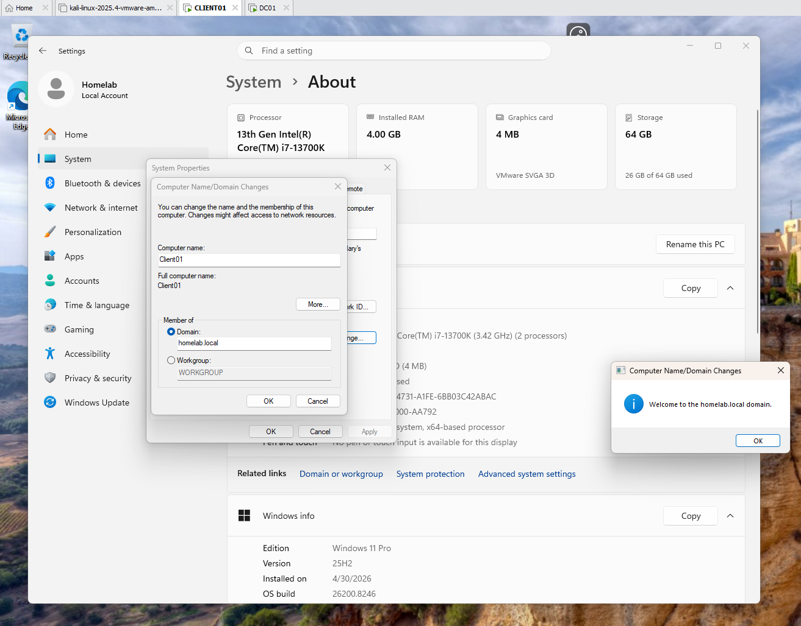

# Windows Server Active Directory Home Lab

## Overview

This project documents the setup of a Windows Server 2025 Active Directory home lab using VMware. The lab simulates a small business domain environment with a domain controller, client machine, user accounts, group permissions, DNS, DHCP, Group Policy, and troubleshooting scenarios.

The goal of this project is to demonstrate hands on IT support skills, including user account management, domain authentication, network services configuration, endpoint management, and structured troubleshooting.

## Lab Objectives

- Build and configure a Windows Server domain environment with Active Directory Domain Services.
- Join Windows 10/11 client machines to the domain.
- Create and manage user accounts, groups, password resets, and account permissions.
- Configure and test DNS and DHCP services.
- Apply Group Policy Objects to enforce user and system restrictions.
- Troubleshoot login failures, DNS issues, and network connectivity problems.
- Document each step with screenshots for portfolio proof.

---

## Lab Environment

| Device   | OS                    | Purpose                          |
|----------|----------------------|----------------------------------|
| DC01     | Windows Server 2025  | Domain Controller (AD, DNS, DHCP) |
| CLIENT01 | Windows 10/11        | Domain Client Machine             |

---

## Network Configuration

| Device   | IP Address      | DNS Server      |
|----------|----------------|-----------------|
| DC01     | 192.168.29.128 | 192.168.29.128  |
| CLIENT01 | DHCP Assigned  | 192.168.29.128  |

---

## Step 1: Virtual Machine Setup

I created two virtual machines in VMware to simulate a small business IT environment. DC01 runs Windows Server 2025 and acts as the domain controller. CLIENT01 runs Windows 10/11 and acts as a client workstation that joins the domain.

---

## Step 2: Static IP Configuration

I configured DC01 with a static IP address so client machines can consistently locate the domain controller. I also set DC01 to use itself as the preferred DNS server because it will provide DNS services for the Active Directory domain.

🔧 DNS Troubleshooting – No Internet After Static IP

After configuring a static IP address on the domain controller (DC01), I encountered an issue where the server was unable to access the internet.

To troubleshoot, I ran the following test:

ping 8.8.8.8

This returned successful replies, confirming that basic network connectivity and routing were working correctly.

However, when testing DNS resolution:

ping google.com

I received the error:

Ping request could not find host google.com

This indicated a DNS resolution issue rather than a network connectivity problem.

🧠 Root Cause

The domain controller was configured to use its own IP address (192.168.29.128) as the DNS server, but the DNS service was not yet fully configured to resolve external domain names.

🔧 Resolution Steps

Temporarily changed the DNS server to a public DNS:

8.8.8.8

This immediately restored internet access and confirmed the issue was DNS-related.

Reconfigured the DNS back to the domain controller:

192.168.29.128

After reapplying the configuration, DNS resolution began working correctly.

---

## Step 3: Installing Active Directory Domain Services

I installed the Active Directory Domain Services role on DC01 to manage domain users, computers, and policies.

---

## Step 4: Domain Controller Setup

I promoted DC01 to a domain controller and created a new forest named homelab.local, enabling centralized authentication and management.

---

## Step 5: Organizational Units

I created Organizational Units (OUs) including:

IT

Sales

HR

Workstations

Servers

These OUs help organize resources and allow targeted Group Policy application.

---

## Step 6: User and Group Management

I created multiple domain users and security groups within specific Organizational Units (IT, Sales, and HR) in Active Directory. 

Users were organized based on department to reflect a real world business structure. I also created security groups such as IT Support and Sales Users, and assigned users to these groups to simulate access control and permission management.

This step demonstrates hands on experience with account creation, group based access control, and basic identity management tasks commonly performed in Tier 1 IT support roles.

---

## Step 7: Password Policy

I configured password and account lockout policies through Group Policy Management to enforce stronger security controls in the domain environment.

The password policy was set as follows: password history of 5 remembered passwords, maximum password age of 32 days, minimum password age of 1 day, and a minimum password length of 8 characters.

The account lockout policy was configured with an account lockout duration of 5 minutes, a threshold of 5 invalid logon attempts, and the lockout counter resets after 5 minutes.

These settings help simulate real world business security practices by preventing password reuse, enforcing regular password changes, and protecting against brute force login attempts.

---

## Step 8: DNS Configuration

I verified that DNS was installed and configured with the homelab.local forward lookup zone. I tested name resolution using nslookup and ping to confirm that the domain could be resolved successfully.

---

## Step 9: DHCP Configuration

I installed and configured the DHCP Server role on DC01 to automatically assign IP addresses to client computers in the domain environment.

A new IPv4 DHCP scope was created for the homelab network. The scope assigns client IP addresses from 192.168.1.100 to 192.168.1.200 using a 255.255.255.0 subnet mask.

The DHCP options were configured with a default gateway of 192.168.1.1, DNS server of 192.168.29.2, and domain name of homelab.local.

This setup simulates how businesses automatically manage IP address assignments for workstations instead of manually configuring every device.

---

## Step 10: Domain Join

On CLIENT01, I configured the DNS settings to point to the Domain Controller (192.168.29.128) to ensure proper communication with the domain.

I then joined the computer to the homelab.local domain using domain administrator credentials. After restarting the system, the domain join was successful. This was verified by confirming the full device name as client01.homelab.local in system settings.

After joining the domain, I logged into CLIENT01 using a domain user account (homelab\welly) to verify authentication through Active Directory. I confirmed the login by running the whoami command, which showed the domain user, proving that authentication is being handled by the Domain Controller.

This step demonstrates how a client machine can join a domain and allow users to log in using centralized credentials, which is standard in real business environments.

---

## Step 11:  Group Policy Configuration

I created and applied a Group Policy Object to restrict access to the Control Panel and PC settings for domain users. On the CLIENT01 machine, I logged in as the domain user welly and ran the gpupdate /force command to immediately apply the updated policy. I then verified the result by attempting to access the Control Panel and confirmed that access was successfully blocked for the user.

---

## Troubleshooting Scenarios

### Login Failure

Problem: User could not log in  
Cause: Account disabled  
Fix: Re-enabled account in Active Directory  

---

### DNS Issue

Problem: Domain not resolving  
Cause: Incorrect DNS settings  
Fix: Updated DNS to domain controller  

---

### Network Issue

Problem: No connectivity  
Cause: Network adapter disabled  
Fix: Re-enabled adapter and renewed IP  

---

## Troubleshooting Method

For each issue, I followed a structured troubleshooting process:

1. Identify the issue  
2. Gather information  
3. Test possible causes  
4. Apply a fix  
5. Verify resolution  
6. Document results  

---

## Skills Demonstrated

- Active Directory administration  
- Windows Server configuration  
- User account management  
- DNS and DHCP configuration  
- Group Policy management  
- Domain authentication  
- IT troubleshooting  
- Technical documentation  
